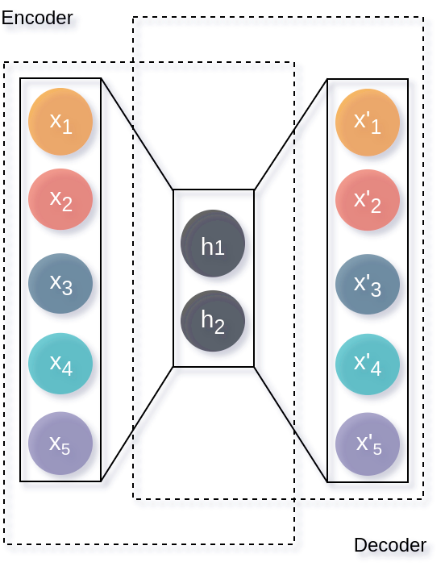
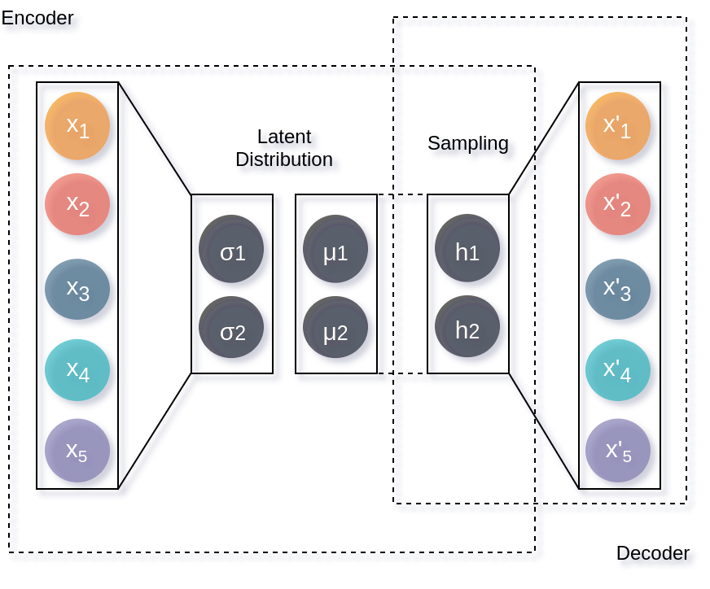

===================
Introduction
===================

.. contents:: :local:

The `atomistic` module is designed to deploy machine learning (ML) models
where the atom is the central object. ML potentials and force fields might be
the best known cases of atom-centered models. These models are accurate for
tasks such as the prediction of energy and atomic forces. They also are 
powerful because they can generalize to larger molecular as long as the local
environments are sampled extensively to cover large domains.

========
Theory
========

The basic idea behind atomistic machine learning is to exploit the phenomenon
of "locality" and predict molecular or periodic properties as the sum of
local contributions:

.. math::

   P = \sum_{i=1}^n P_{atom}(R^{local})

where :math:`P_{atom}` is a functional of atomic positions. In the case the
properties are atomic by nature, e.g. atomic forces or atomic charges, there
is no need to carry out the sum shown above as the output of the models are
atomic.

==========================
Atomic Features
==========================

ML models require a set of measurable characteristics, properties or
information related to the phenomenon that we want to learn. These are known
as "features", and they play a very important role in any ML model. Features
need to be relevant, unique, independent, and for our purposes be
physics-constrained e.g. rotational and translational invariance.

ML4Chem supports by default Gaussian symmetry functions, and atomic latent
features.

Gaussian symmetry functions 
---------------------------
In 2007, Behler and Parrinello [Behler2007]_ introduced a fixed-length
feature vector, referred also as "symmetry functions" (SF), to generalize the
representation of high-dimensional potential energy surfaces with artificial
neural networks and overcome the limitations related to the image-centered
models. These SF are atomic feature vectors constructed purely from atomic
positions, and their main objective is to define the *relevant chemical
environment* of atoms in a material.

For building these features, we need to define a cutoff function
(:math:`f_c`) to delimit the *effective range* of interactions within the
domain of a central atom.

.. math::
    f_c(r) =
    \begin{cases}
        0.5(1+cos(\pi \frac{r}{R_c}))   , & \text{if}\ r \leq R_c, \\
                                    0   , & \text{if}\ r \geq R_c,
    \end{cases}

where :math:`R_c` is the cutoff radius (in unit length), and :math:`r` is
the inter-atomic distance between atoms :math:`i` and :math:`j`. The
cutoff function, having Cosine shape, vanishes for inter-atomic separations
larger than :math:`R_c` whereas it takes a finite value below the cutoff
radius. Cutoff functions avoid abrupt changes on feature magnitudes near the
boundary by smoothly damping them.

There are different types of SFs to consider when building Behler-Parrinello
feature vectors: i) the radial (two-body term) and ii) angular (three-body
terms) SFs. The radial SFs account for all interactions of a central atom
:math:`i` with its nearest neighbors atoms :math:`j`. It is defined by,

.. math::
    \mathbf{G_i^2} = \sum_{j = 1}^{N_{atom}} e^{-\eta(\mathbf{R_{ij}}-R_{s})^2/R_c^2} f_c(R_{ij}),

where :math:`\mathbf{R_{ij}}` is the euclidean distance between central
:math:`i` and neighbor :math:`j` atoms, :math:`R_s` defines the center of the
Gaussian, and :math:`\eta` is related to its width. Each value in the sum is
normalized by the square of the cutoff radius, :math:`R_c^2`. In practice,
one builds a high-dimensional feature vector by choosing different
:math:`\eta` values.

In addition to the radial SF, it is possible to include triplet many-body
interactions within the cutoff radius :math:`R_c` through the following
angular SFs:

.. math::
    \mathbf{G_i^3} = 2^{1-\zeta} \sum_{j, k \neq i} (1 + \lambda cos\theta_{ijk})^{\zeta} e^{-\eta
        (\mathbf{R_{ij}}^2 + \mathbf{R_{ik}}^2 + \mathbf{R_{jk}}^2)/R_c^2} f_c(R_{ij}) f_c(R_{ik})
        f_c(R_{jk}).

This part of the features is built from considering the Cosine between all
possible :math:`\theta_{ijk}` angle of a central atom. There exists a variant of
:math:`\mathbf{G_i^3}` that includes three-body interactions of atoms forming
:math:`180^{\circ}` inside the cutoff sphere but having an interatomic
separation larger than :math:`Rc`. These SFs account for long-range
interactions [Behler2015]_:

.. math::
    \mathbf{G_i^4} = 2^{1-\zeta} \sum_{j, k \neq i} (1 + \lambda cos\theta_{ijk})^{\zeta} e^{-\eta
        (\mathbf{R_{ij}}^2 + \mathbf{R_{ik}}^2)/R_c^2} f_c(R_{ij}) f_c(R_{ik}).

An atomic Behler-Parrinello feature vector will be composed by a subvector
with radial SFs and another subvector of angular SFs. This represents an
advantage when it comes to evaluate which type of SFs is more important when
predicting energy and atomic forces.

::

    from ml4chem.fingerprints.gaussian import Gaussian

    features = Gaussian(cutoff=6.5, normalized=True, save_preprocessor="features.scaler")

In the code snippet above we are building Gaussian type using the
:class:`ml4chem.fingerprints.gaussian.Gaussian` class. We use a ``cutoff``
radius of :math:`6.5` angstrom, normalized, and the preprocessing is saved to
the file ``features.scaler`` (by default the scaler is ``MinMaxScaler`` in a
range :math:`(-1, 1)` as implemented in ``scikit-learn``). The ``angular``
symmetry function used by default is :math:`G_i^3`, if you are interested in
using :math:`G_i^4`, then you need to pass ``angular_type`` keyword
argument::

    features = Gaussian(cutoff=6.5, normalized=True,
                        save_preprocessor="features.scaler", angular_type="G4")

Atomic latent features 
---------------------------
These features are decided by the neural network and can be obtained with the
`Autoencoder` class. 

==========================
Models
==========================

Neural Networks
----------------
Neural Network (NN) are models inspired on how the human brain works. They
consist of a set of hidden-layers with some nodes (neurons). The most simple NN
architecture is the *fully-connected* case in which each neuron is inter-connected
to every other neuron in the previous/next layer, and each connection has its own
weight. When an activation function is applied to the output of a
neuron, the NN is able to learn non-linearity aspects from the data.

In ML4Chem, a neural network can be instantiated as shown below:

:: 

    from ml4chem.models.neuralnetwork import NeuralNetwork

    n = 10
    activation = "relu"
    nn = NeuralNetwork(hiddenlayers=(n, n), activation=activation)
    nn.prepare_model()

Here, weare building a NN with the
:class:`ml4chem.models.neuralnetwork.NeuralNetwork` class with two
hidden-layers composed 10 neurons each, and a ReLu activation function.

Autoencoders
-------------
Autoencoders (AE) are NN architectures that able to extract features from
data in an unsupervised learning manner. AE learns how to encode information
because of a hidden-layer that serves as an informational bottleneck as shown
in the figure below. In addition, this latent code is used by the decoder to
reconstruct the input data.

:: 

    from ml4chem.models.autoencoders import AutoEncoder

    hiddenlayers = {"encoder": (20, 10, 4), "decoder": (4, 10, 20)}
    activation = "tanh"
    autoencoder = AutoEncoder(hiddenlayers=hiddenlayers, activation=activation)
    data_handler.get_unique_element_symbols(images, purpose=purpose)
    autoencoder.prepare_model(input_dimension, output_dimension, data=data_handler)

ML4Chem also provides access to variational autoencoders (VAE). These
architectures differ from an AE in that the encoder codes a distribution with
mean and variance (two vectors with the desired latent space dimension)
instead of a single latent vector. Subsequently, this distribution is sampled
and used by the decoder to reconstruct the input. This creates a generative
model because now we will generate a latent distribution that allows a
continuous change from one class to another.

:: 

To use this architecture, it just suffices to change the snippet shown above
for an AE as follows:

:: 

    from ml4chem.models.autoencoders import VAE

    hiddenlayers = {"encoder": (20, 10, 4), "decoder": (4, 10, 20)}
    activation = "tanh"
    vae = VAE(hiddenlayers=hiddenlayers, activation=activation, multivariate=True)
    data_handler.get_unique_element_symbols(images, purpose=purpose)
    vae.prepare_model(input_dimension, output_dimension, data=data_handler)

Kernel Ridge Regression
------------------------
Kernel Ridge Regression (KRR) is a type of support vector machine model that
combines Ridge Regression with the kernel trick. In ML4Chem, this method is
implemeted as described by Rupp in Ref. [Rupp2015]_. Below there is a
description of this implementation:

#. Molecules are featurized.  
#. A kernel function :math:`k(x, y)` is applied to all possible pairs of
   atoms in the training data to build a covariance matrix, :math:`\mathbf{K}`.
#. :math:`\mathbf{K}` is decomposed in upper- and lower- triangular matrices
   using Cholesky decomposition.
#. Finally, forward- and backward substitution is carried out with desired targets.

Gaussian Process Regression
------------------------
Gaussian Process Regression (GP) is similar to KRR with the addition of the
uncertainty of each prediction.

**References:**

.. [Behler2007] Behler, J. & Parrinello, M. Generalized Neural-Network Representation of High-Dimensional Potential-Energy Surfaces. Phys. Rev. Lett. 98, 146401 (2007).
.. [Behler2015] Behler, J. Constructing high-dimensional neural network potentials: A tutorial review. Int. J. Quantum Chem. 115, 1032–1050 (2015).
.. [Rupp2015] Rupp, M. Machine learning for quantum mechanics in a nutshell. Int. J. Quantum Chem. 115, 1058–1073 (2015).